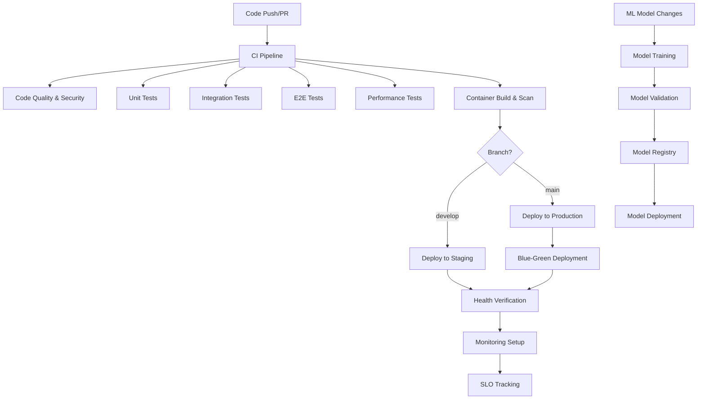

# CI/CD Pipeline Documentation

## Overview

This document provides comprehensive documentation for the Malaria Prediction Backend CI/CD pipeline, including deployment strategies, monitoring, and operational procedures.

## Table of Contents

1. [Pipeline Architecture](#pipeline-architecture)
2. [Workflows](#workflows)
3. [Deployment Strategies](#deployment-strategies)
4. [Security & Quality Gates](#security--quality-gates)
5. [Monitoring & Alerting](#monitoring--alerting)
6. [Runbooks](#runbooks)
7. [Troubleshooting](#troubleshooting)

## Pipeline Architecture



## Workflows

### 1. CI Pipeline (`.github/workflows/ci.yml`)

**Trigger Events:**
- Push to `main`, `develop`, `feature/*`, `hotfix/*`
- Pull requests to `main`, `develop`

**Jobs:**
- **Code Quality & Security**: Linting, type checking, security scanning
- **Unit Tests**: Fast, isolated tests with 95%+ coverage requirement
- **Integration Tests**: Database, Redis, external API integration
- **E2E Tests**: Full application workflow testing
- **Performance Tests**: Load testing and regression checks
- **Container Security**: Vulnerability scanning of Docker images
- **Build Images**: Multi-architecture container builds

**Quality Gates:**
- Unit test coverage: 85% overall, 95% for critical modules
- All security scans must pass
- Performance regression threshold: <10% degradation
- All tests must pass (configurable skip for draft PRs)

### 2. Deployment Pipeline (`.github/workflows/deploy.yml`)

**Trigger Events:**
- Successful CI pipeline completion
- Manual workflow dispatch

**Environments:**
- **Staging**: Rolling deployment strategy
- **Production**: Blue-green deployment with canary testing

**Features:**
- Database migration automation
- Health checks and rollback capabilities
- Post-deployment validation
- Monitoring integration

### 3. ML Model Pipeline (`.github/workflows/ml-model-deploy.yml`)

**Trigger Events:**
- Changes to ML model code
- Manual model deployment requests

**Features:**
- Automated model training and validation
- Model comparison and champion selection
- MLflow model registry integration
- A/B testing deployment capability
- Model drift monitoring setup

### 4. Security Pipeline (`.github/workflows/security.yml`)

**Trigger Events:**
- Push to main branches
- Pull requests
- Daily scheduled scans
- Manual security audits

**Scan Types:**
- Static code analysis (Bandit, Semgrep)
- Dependency vulnerability scanning (Safety, OSV)
- Container security scanning (Trivy, Grype)
- Infrastructure security (Checkov, kube-score)

### 5. Monitoring Integration (`.github/workflows/monitoring.yml`)

**Trigger Events:**
- Successful deployments
- Manual monitoring setup

**Features:**
- Post-deployment health verification
- Alert configuration
- Dashboard creation
- SLO monitoring setup

## Deployment Strategies

### Staging Deployment (Rolling Update)

```yaml
Strategy: RollingUpdate
MaxSurge: 1
MaxUnavailable: 1
HealthChecks: Enabled
Rollback: Automatic on failure
```

**Process:**
1. Build and test new version
2. Deploy to staging cluster
3. Wait for rollout completion
4. Run smoke tests
5. Update deployment annotations

### Production Deployment (Blue-Green)

```yaml
Strategy: Blue-Green
Slots: Blue/Green
Traffic Switching: Instant
Validation: Comprehensive
Rollback: Automatic within 5 minutes
```

**Process:**
1. Determine current active slot (blue/green)
2. Deploy to inactive slot
3. Run pre-switch validation
4. Switch traffic to new slot
5. Monitor for 2 minutes
6. Clean up old deployment on success

**Blue-Green Benefits:**
- Zero-downtime deployments
- Instant rollback capability
- Full validation before traffic switch
- Reduced risk for production changes

## Security & Quality Gates

### Code Quality Requirements

- **Linting**: Ruff with strict configuration
- **Type Checking**: MyPy with strict mode
- **Test Coverage**: 85% overall, 95% for critical modules
- **Security**: No critical vulnerabilities allowed

### Security Scanning

1. **Static Code Analysis**
   - Bandit for Python security issues
   - Semgrep for additional security patterns
   - Custom secret detection rules

2. **Dependency Scanning**
   - Safety for known vulnerabilities
   - OSV scanner for comprehensive checks
   - Automated dependency updates

3. **Container Security**
   - Trivy for comprehensive container scanning
   - Grype for additional vulnerability detection
   - Base image security analysis

4. **Infrastructure Security**
   - Checkov for IaC security
   - kube-score for Kubernetes best practices
   - Security policy compliance checks

### Quality Gates Configuration

```yaml
Critical Thresholds:
  - Security vulnerabilities: 0 critical, 0 high
  - Test coverage: >85% overall, >95% critical
  - Performance degradation: <10%
  - Code quality: No critical issues

Warning Thresholds:
  - Medium security issues: <5
  - Test coverage: >80%
  - Performance degradation: <20%
  - Technical debt: Tracked but not blocking
```

## Monitoring & Alerting

### Application Metrics

- **Health Metrics**: Liveness, readiness, startup probes
- **Performance Metrics**: Response time, throughput, error rates
- **Business Metrics**: Prediction accuracy, data freshness
- **Infrastructure Metrics**: CPU, memory, disk, network

### Alert Categories

1. **Critical Alerts** (Immediate Response)
   - Application down
   - High error rate (>5%)
   - Database connection failure
   - Model accuracy drop

2. **Warning Alerts** (Response within 30 minutes)
   - High response time (>2s)
   - Resource utilization (>80%)
   - Data staleness (>2 hours)

3. **Info Alerts** (Daily review)
   - Deployment notifications
   - Performance trends
   - Capacity planning metrics

### SLO Definitions

| Service Level Objective | Target | Measurement Window |
|------------------------|--------|-------------------|
| Availability | 99.9% | 30 days |
| Response Time (95th percentile) | <2 seconds | 7 days |
| Error Rate | <0.5% | 30 days |
| Data Freshness | <2 hours | 24 hours |

## Runbooks

### [Deployment Runbook](runbooks/deployment.md)

Standard operating procedures for deployments:
- Pre-deployment checklist
- Deployment execution steps
- Post-deployment verification
- Rollback procedures

### [Incident Response Runbook](runbooks/incident-response.md)

Emergency procedures for critical issues:
- Incident classification
- Response team contacts
- Escalation procedures
- Communication templates

### [Security Incident Runbook](runbooks/security-incident.md)

Security-specific incident handling:
- Security alert triage
- Vulnerability response procedures
- Security patching workflows
- Incident documentation

### [Database Operations Runbook](runbooks/database-operations.md)

Database maintenance and emergency procedures:
- Migration procedures
- Backup and recovery
- Performance troubleshooting
- Connection issues

## Troubleshooting

### Common Issues

1. **Pipeline Failures**
   - Test failures: Check logs, identify root cause
   - Build failures: Dependency issues, environment problems
   - Deployment failures: Resource constraints, configuration errors

2. **Security Scan Failures**
   - False positives: Update scan configurations
   - Real vulnerabilities: Follow security response procedures
   - Compliance issues: Review and update policies

3. **Performance Issues**
   - Slow tests: Optimize test execution
   - Resource constraints: Scale infrastructure
   - Network timeouts: Review connectivity and timeouts

### Debug Commands

```bash
# Check pipeline status
gh workflow list
gh run list --workflow=ci.yml

# View logs
gh run view <run-id> --log

# Debug deployment
kubectl describe deployment malaria-predictor-api -n malaria-prediction-staging
kubectl logs -f deployment/malaria-predictor-api -n malaria-prediction-staging

# Check health endpoints
curl -v https://api-staging.malaria-prediction.com/health/liveness
curl -v https://api.malaria-prediction.com/health/readiness

# Monitor resource usage
kubectl top pods -n malaria-prediction-production
kubectl get hpa -n malaria-prediction-production
```

### Emergency Contacts

- **DevOps Team**: devops@malaria-prediction.com
- **Security Team**: security@malaria-prediction.com
- **On-Call Engineer**: +1-555-ONCALL
- **Slack Channels**: #alerts, #deployments, #security

## Configuration

### Environment Variables

```bash
# Required for all environments
DATABASE_URL=postgresql+asyncpg://...
REDIS_URL=redis://...
SECRET_KEY=...

# Environment-specific
ENVIRONMENT=production|staging|development
LOG_LEVEL=INFO|DEBUG|WARNING

# External APIs
ERA5_API_KEY=...
MODIS_API_KEY=...
MAP_API_KEY=...

# Monitoring
PROMETHEUS_URL=...
GRAFANA_URL=...
SENTRY_DSN=...

# CI/CD specific
GITHUB_TOKEN=...
SLACK_WEBHOOK_URL=...
MLFLOW_TRACKING_URI=...
```

### Secrets Management

Secrets are managed through:
- **Kubernetes Secrets**: For application runtime
- **GitHub Secrets**: For CI/CD pipeline
- **External Secret Operators**: For secret rotation
- **HashiCorp Vault**: For production secret management

### Infrastructure Requirements

**Staging Environment:**
- 2 vCPU, 4GB RAM minimum per pod
- 2-3 pod replicas
- PostgreSQL with 100GB storage
- Redis with 8GB memory

**Production Environment:**
- 4 vCPU, 8GB RAM minimum per pod
- 3-10 pod replicas (auto-scaling)
- PostgreSQL cluster with 500GB+ storage
- Redis cluster with 32GB+ memory
- Load balancer with SSL termination

## Best Practices

### Development Workflow

1. **Feature Development**
   - Create feature branch from `develop`
   - Write tests first (TDD approach)
   - Ensure all quality gates pass
   - Request code review

2. **Code Review Guidelines**
   - Security implications review
   - Performance impact assessment
   - Test coverage verification
   - Documentation updates

3. **Release Process**
   - Merge to `develop` for staging deployment
   - Integration testing in staging
   - Merge to `main` for production deployment
   - Tag releases with semantic versioning

### Security Best Practices

- Never commit secrets to version control
- Use principle of least privilege
- Regularly update dependencies
- Monitor security alerts
- Conduct regular security reviews

### Performance Best Practices

- Monitor key performance metrics
- Set up performance regression alerts
- Optimize database queries
- Use caching effectively
- Profile application regularly

## Maintenance

### Regular Tasks

**Daily:**
- Review monitoring dashboards
- Check for security alerts
- Monitor error rates and performance

**Weekly:**
- Review and update dependencies
- Check resource utilization trends
- Review deployment metrics

**Monthly:**
- Security vulnerability assessment
- Performance review and optimization
- Infrastructure capacity planning
- Runbook updates and testing

### Disaster Recovery

**Backup Strategy:**
- Database: Automated daily backups with 30-day retention
- Application data: Persistent volume snapshots
- Configuration: Version controlled in Git
- Secrets: Backed up in secure vault

**Recovery Procedures:**
- RTO (Recovery Time Objective): 1 hour
- RPO (Recovery Point Objective): 24 hours
- Failover to backup region capability
- Data integrity verification procedures
