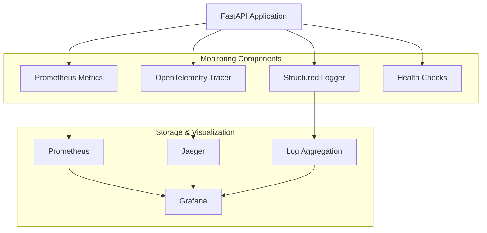

# Production Monitoring & Observability Setup

This document provides comprehensive guidance for setting up and managing production monitoring and observability for the Malaria Prediction Backend system.

## Overview

The monitoring system provides complete observability through:

- **Structured JSON Logging** with correlation IDs for request tracing
- **Prometheus Metrics** for API, ML models, and system performance
- **OpenTelemetry Distributed Tracing** for request flow analysis
- **Health Checks** for all system components
- **Grafana Dashboards** for visualization and alerting
- **Performance Monitoring** with automatic slow request detection

## Architecture



## Quick Start

### 1. Enable Monitoring in Configuration

Update your `.env` file:

```bash
# Monitoring Configuration
MONITORING__ENABLE_METRICS=true
MONITORING__ENABLE_TRACING=true
MONITORING__LOG_LEVEL=INFO
MONITORING__LOG_FORMAT=json
MONITORING__METRICS_PORT=9090
MONITORING__HEALTH_CHECK_INTERVAL=30
```

### 2. Initialize Monitoring in FastAPI

```python
from fastapi import FastAPI
from malaria_predictor.monitoring import (
    setup_logging,
    PrometheusMiddleware,
    TracingMiddleware,
    HealthCheckMiddleware,
    PerformanceMonitoringMiddleware
)

# Initialize logging
setup_logging()

app = FastAPI(title="Malaria Prediction API")

# Add monitoring middleware (order matters!)
app.add_middleware(PerformanceMonitoringMiddleware)
app.add_middleware(HealthCheckMiddleware)
app.add_middleware(TracingMiddleware)
app.add_middleware(PrometheusMiddleware)
```

### 3. Start Supporting Services

Using Docker Compose:

```yaml
version: '3.8'
services:
  prometheus:
    image: prom/prometheus:latest
    ports:
      - "9090:9090"
    volumes:
      - ./monitoring/prometheus.yml:/etc/prometheus/prometheus.yml

  grafana:
    image: grafana/grafana:latest
    ports:
      - "3000:3000"
    environment:
      - GF_SECURITY_ADMIN_PASSWORD=admin
    volumes:
      - grafana-storage:/var/lib/grafana

  jaeger:
    image: jaegertracing/all-in-one:latest
    ports:
      - "16686:16686"
      - "14268:14268"
```

## Component Details

### Structured Logging

The logging system provides JSON-structured logs with correlation IDs for complete request tracing.

#### Features
- **JSON Format**: Machine-readable structured logs
- **Correlation IDs**: Track requests across all components
- **Performance Logging**: Automatic timing for operations
- **Context Management**: Automatic request context injection
- **Multiple Outputs**: Console, file, and syslog support

#### Usage Example
```python
from malaria_predictor.monitoring import get_logger, RequestContextLogger

logger = get_logger(__name__)

# Basic logging
logger.info("Processing prediction request", extra={
    "user_id": "user123",
    "model_type": "lstm",
    "confidence": 0.95
})

# With request context
with RequestContextLogger(request_id="req-123", user_id="user123"):
    logger.info("Starting prediction")
    # All logs in this context will include request_id and user_id
```

#### Log Structure
```json
{
  "timestamp": "2024-01-15T10:30:00.000Z",
  "level": "INFO",
  "logger": "malaria_predictor.api.prediction",
  "message": "Prediction completed successfully",
  "correlation": {
    "request_id": "req-123",
    "user_id": "user123",
    "operation": "POST /predict/single"
  },
  "extra": {
    "model_type": "lstm",
    "confidence": 0.95,
    "duration_ms": 150
  }
}
```

### Prometheus Metrics

Comprehensive metrics collection for all system components.

#### API Metrics
- `malaria_api_requests_total` - Total API requests by method, endpoint, status
- `malaria_api_request_duration_seconds` - Request duration histogram
- `malaria_api_request_size_bytes` - Request size histogram
- `malaria_api_response_size_bytes` - Response size histogram
- `malaria_api_errors_total` - API errors by type
- `malaria_api_active_connections` - Current active connections

#### ML Model Metrics
- `malaria_ml_predictions_total` - Total predictions by model type/version
- `malaria_ml_prediction_duration_seconds` - Prediction latency histogram
- `malaria_ml_prediction_confidence` - Prediction confidence histogram
- `malaria_ml_model_memory_usage_bytes` - Model memory usage
- `malaria_ml_model_accuracy` - Model accuracy scores
- `malaria_ml_model_errors_total` - Model errors by type

#### System Metrics
- `malaria_system_cpu_usage_percent` - CPU usage by core
- `malaria_system_memory_usage_percent` - Memory usage percentage
- `malaria_system_disk_usage_percent` - Disk usage by device
- `malaria_system_db_connections_active` - Active database connections
- `malaria_system_cache_hit_rate` - Cache hit rate

#### Custom Metrics Example
```python
from malaria_predictor.monitoring import get_metrics

metrics = get_metrics()

# Record API request
metrics.api_metrics.record_request(
    method="POST",
    endpoint="/predict/single",
    status_code=200,
    duration=0.150,
    request_size=1024,
    response_size=512
)

# Record ML prediction
metrics.ml_metrics.record_prediction(
    model_type="lstm",
    model_version="1.0.0",
    duration=0.100,
    confidence=0.95,
    batch_size=1
)
```

### OpenTelemetry Tracing

Distributed tracing for complete request flow visibility.

#### Features
- **Automatic Instrumentation**: FastAPI, AsyncPG, Redis
- **Custom Spans**: ML operations, database queries, API calls
- **Context Propagation**: Distributed tracing across services
- **Performance Analysis**: Detailed timing and dependencies
- **Error Tracking**: Exception capture and correlation

#### Usage Example
```python
from malaria_predictor.monitoring import (
    trace_async_function,
    get_ml_tracer,
    get_db_tracer
)

# Automatic tracing with decorator
@trace_async_function("ml.predict")
async def predict_malaria_risk(features):
    # This function will be automatically traced
    pass

# Manual tracing for ML operations
ml_tracer = get_ml_tracer()
with ml_tracer.trace_prediction("lstm", "1.0.0", len(features)) as span:
    result = await model.predict(features)

    # Add custom metrics to span
    ml_tracer.add_prediction_metrics(
        span, result.confidence, result.value, processing_time
    )
```

### Health Checks

Comprehensive health monitoring for all system components.

#### Available Health Checks
- **Database**: Connectivity, query performance, connection pool status
- **Redis**: Connectivity, latency, memory usage, operations test
- **ML Models**: Model loading status, inference performance, memory usage
- **External APIs**: Connectivity to ERA5, CHIRPS, WorldPop, MAP APIs

#### Endpoints
- `GET /health` - Basic health status
- `GET /health/detailed` - Detailed component health information
- `GET /health/component/{name}` - Individual component health

#### Health Check Response
```json
{
  "status": "healthy",
  "message": "All 4 components healthy",
  "timestamp": 1642248600.0,
  "response_time_ms": 125.5,
  "checks": [
    {
      "name": "database",
      "status": "healthy",
      "message": "Database healthy (45ms)",
      "response_time_ms": 45.2,
      "details": {
        "query_time_ms": 45.2,
        "connection_pool_size": 20,
        "version": "PostgreSQL 14.1"
      }
    }
  ],
  "summary": {
    "total": 4,
    "healthy": 4,
    "degraded": 0,
    "unhealthy": 0
  }
}
```

### Performance Monitoring

Automatic performance monitoring with request correlation and slow request detection.

#### Features
- **Request Timing**: Automatic response time measurement
- **Slow Request Detection**: Configurable threshold alerting
- **Request Correlation**: Unique IDs for request tracking
- **Client Information**: IP, user agent, and geographic data
- **Resource Usage**: Memory, CPU tracking per request

#### Configuration
```python
app.add_middleware(
    PerformanceMonitoringMiddleware,
    slow_request_threshold=1.0,  # seconds
    log_slow_requests=True,
    track_request_sizes=True
)
```

## Grafana Dashboards

### Available Dashboards

#### 1. API Overview Dashboard
- Request rate and error rate metrics
- Response time percentiles
- Active connections and throughput
- Request rate by endpoint

#### 2. ML Models Dashboard
- Prediction rate and error rate
- Model performance metrics
- Confidence score distributions
- Memory usage by model

#### 3. System Health Dashboard
- CPU and memory usage
- Database connection status
- Cache performance metrics
- Disk usage and I/O metrics

### Dashboard Import

1. Access Grafana at `http://localhost:3000`
2. Import dashboard configurations from `src/malaria_predictor/monitoring/grafana_dashboards_config.json`
3. Configure Prometheus data source: `http://prometheus:9090`

### Custom Dashboard Creation

```python
from malaria_predictor.monitoring.dashboards import get_dashboard_config

config = get_dashboard_config()
dashboards = config.get_dashboards()
alerts = config.get_alerts()

# Export Prometheus alert rules
prometheus_rules = config.export_prometheus_rules()
```

## Alerting

### Alert Rules

The system includes pre-configured alerts for:

- **API High Error Rate**: >5% error rate for 2 minutes
- **API High Response Time**: >1s 95th percentile for 5 minutes
- **ML Model High Error Rate**: >1% error rate for 2 minutes
- **High CPU Usage**: >80% for 5 minutes
- **High Memory Usage**: >85% for 5 minutes
- **Database Connection Pool Exhaustion**: >90% utilization
- **Low Cache Hit Rate**: <80% for 10 minutes

### Alert Configuration

Alerts are configured in Prometheus format and can be exported:

```bash
# Export alert rules
python -c "
from malaria_predictor.monitoring.dashboards import get_dashboard_config
config = get_dashboard_config()
print(config.export_prometheus_rules())
" > alerts.yml
```

### Notification Channels

Configure notification channels in Grafana:

1. **Email**: For critical alerts
2. **Slack**: For team notifications
3. **PagerDuty**: For on-call escalation
4. **Webhook**: For custom integrations

## Production Deployment

### Docker Configuration

```dockerfile
# Dockerfile
FROM python:3.11-slim

# Install monitoring dependencies
RUN pip install prometheus-client opentelemetry-api opentelemetry-sdk

# Copy monitoring configuration
COPY monitoring/ /app/monitoring/

# Expose metrics port
EXPOSE 8000 9090

# Set monitoring environment
ENV MONITORING__ENABLE_METRICS=true
ENV MONITORING__ENABLE_TRACING=true
ENV MONITORING__LOG_FORMAT=json
```

### Kubernetes Deployment

```yaml
apiVersion: apps/v1
kind: Deployment
metadata:
  name: malaria-prediction-api
spec:
  template:
    spec:
      containers:
      - name: api
        image: malaria-prediction-api:latest
        ports:
        - containerPort: 8000
          name: http
        - containerPort: 9090
          name: metrics
        env:
        - name: MONITORING__ENABLE_METRICS
          value: "true"
        - name: MONITORING__ENABLE_TRACING
          value: "true"
        livenessProbe:
          httpGet:
            path: /health
            port: 8000
          initialDelaySeconds: 30
          periodSeconds: 10
        readinessProbe:
          httpGet:
            path: /health
            port: 8000
          initialDelaySeconds: 5
          periodSeconds: 5
---
apiVersion: v1
kind: Service
metadata:
  name: malaria-prediction-api
  annotations:
    prometheus.io/scrape: "true"
    prometheus.io/port: "9090"
spec:
  ports:
  - port: 80
    targetPort: 8000
    name: http
  - port: 9090
    targetPort: 9090
    name: metrics
  selector:
    app: malaria-prediction-api
```

### Prometheus Configuration

```yaml
# prometheus.yml
global:
  scrape_interval: 15s
  evaluation_interval: 15s

rule_files:
  - "alert_rules.yml"

scrape_configs:
  - job_name: 'malaria-prediction-api'
    static_configs:
      - targets: ['malaria-prediction-api:9090']

alerting:
  alertmanagers:
    - static_configs:
        - targets:
          - alertmanager:9093
```

## Troubleshooting

### Common Issues

#### High Memory Usage
1. Check ML model memory usage: `malaria_ml_model_memory_usage_bytes`
2. Verify connection pool settings
3. Monitor request payload sizes

#### Slow Response Times
1. Check database query performance
2. Verify ML model inference times
3. Monitor external API response times
4. Check for high CPU usage

#### Missing Metrics
1. Verify Prometheus configuration
2. Check middleware initialization order
3. Ensure monitoring is enabled in configuration

#### Health Check Failures
1. Check individual component health endpoints
2. Verify database and Redis connectivity
3. Check external API accessibility

### Log Analysis

Query structured logs for troubleshooting:

```bash
# Find slow requests
jq 'select(.extra.duration_ms > 1000)' < app.log

# Find errors by request ID
jq 'select(.correlation.request_id == "req-123")' < app.log

# Analyze API endpoints
jq -r '.correlation.operation' < app.log | sort | uniq -c
```

### Performance Optimization

1. **Adjust Connection Pools**: Based on concurrent request patterns
2. **Optimize ML Models**: Monitor inference times and memory usage
3. **Tune Caching**: Monitor cache hit rates and adjust TTL
4. **Database Optimization**: Analyze slow queries and add indexes

## Maintenance

### Regular Tasks

1. **Weekly**:
   - Review dashboard metrics for trends
   - Check alert firing frequency
   - Analyze slow request patterns

2. **Monthly**:
   - Update alerting thresholds based on patterns
   - Review log retention and storage usage
   - Optimize dashboard configurations

3. **Quarterly**:
   - Review monitoring infrastructure scaling
   - Update monitoring tool versions
   - Conduct monitoring system health review

### Monitoring the Monitoring

Set up meta-monitoring to ensure the monitoring system itself is healthy:

- **Prometheus Up Time**: Monitor Prometheus availability
- **Grafana Health**: Monitor dashboard loading times
- **Log Ingestion Rate**: Ensure logs are being processed
- **Metric Collection Rate**: Verify metric collection intervals

## Security Considerations

1. **Access Control**: Restrict monitoring endpoints to authorized users
2. **Data Sensitivity**: Avoid logging sensitive user data
3. **Network Security**: Use TLS for monitoring traffic
4. **Authentication**: Secure Grafana and Prometheus access
5. **Log Retention**: Implement appropriate log retention policies

## Support and Documentation

- **Monitoring Components**: See `src/malaria_predictor/monitoring/`
- **Configuration**: See `.env.example` for all monitoring settings
- **Dashboards**: Located in `grafana_dashboards_config.json`
- **Health Checks**: Documented in `health.py`
- **Metrics**: Full metric list in `metrics.py`

For additional support, check the monitoring system logs and health endpoints to diagnose issues.
